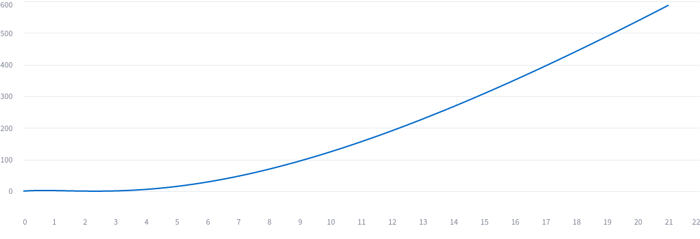
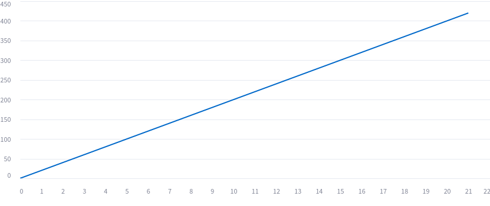
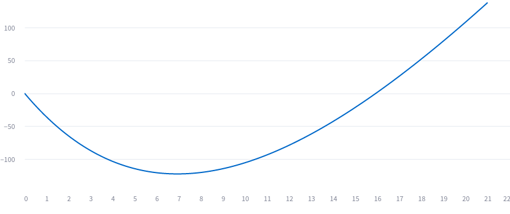
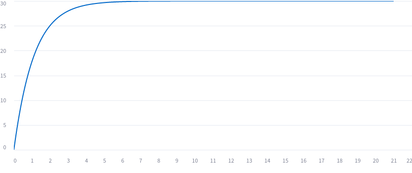
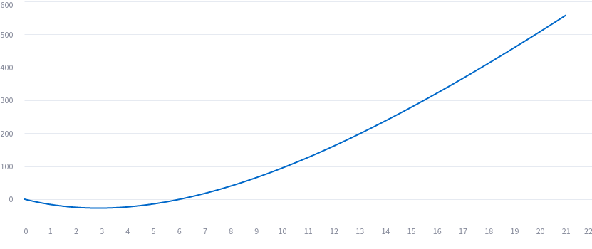
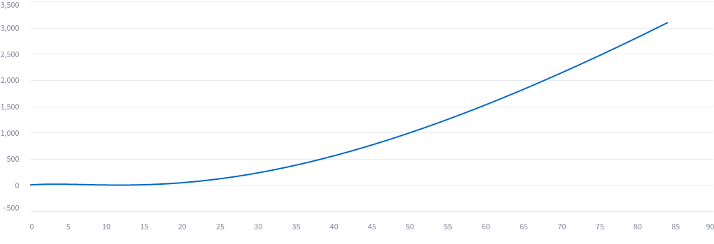

# About Controlling Fee Rates and P&L for Lightning Network Routing Nodes

**Work in Progress:** This piece of work should be interpreted as thoughts by
the author only. It probably still contains minor and possibly even major errors
at this stage.
The paper attempts to analyze and describe fee and P&L control for a routing node
using mathematics.

Created by: feelancer21@github

## List of Contents

1. [Overview](#overview)
2. [About Arbitrage Freeness with Negative Forward Fees](#about-arbitrage-freeness-with-negative-forward-fees)
   1. [Definitions and Assumptions](#definitions-and-assumptions)
   2. [Arbitrage Freeness](#arbitrage-freeness)
3. [Modelling Outbound and Inbound Fee Rates with Margin and Liquidity Spread](#modelling-outbound-and-inbound-fee-rates-with-margin-and-liquidity-spread)
   1. [The Margin Spread Model](#the-margin-spread-model)
   2. [Rationale for Margin and Spread](#rationale-for-margin-and-spread)
      1. [Margin in Circular Case](#margin-in-circular-case)
      2. [Margin in Two-Party Case](#margin-in-two-party-case)
      3. [Role of the Spread](#role-of-the-spread)
   3. [Practical Setting](#practical-setting)
   4. [Explain the P&L of a Routing Node](#explain-the-pl-of-a-routing-node)
      1. [P&L Explain for Forwards](#pl-explain-for-forwards)
         - Forwards: Separation of the Source Margin
         - Forwards: Separation of the Target Margin
      2. [P&L Explain for Rebalancings](#pl-explain-for-rebalancings)
         - Rebalancing: Separation of the Benefit in the Source Margin
         - Rebalancing: Separation of the Benefit in the Target Margin
      3. [Adjustments of the Potentials](#adjustments-of-the-potentials)
   5. [Margin Spread Model with #bLIP19 Inbound Fees](#margin-spread-model-with-blip19-inbound-fees)
4. [Modelling the Spread Rate with Exponential Moving Averages](#modelling-the-spread-rate-with-exponential-moving-averages)
   1. [Basics](#basics)
   2. [Modelling the Dynamic of the Spread Rate](#modelling-the-dynamic-of-the-spread-rate)
      1. [Proportional Part](#proportional-part)
      2. [Exponential Decay of a Function](#exponential-decay-of-a-function)
      3. [Integral Part](#integral-part)
      4. [Derivative Part](#derivative-part)
      5. [Multi Controller Approach](#multi-controller-approach)
   3. [Behavior after a Simple Impulse](#behavior-after-a-simple-impulse)
   4. [Example for a Spread Rate Controller](#example-for-a-spread-rate-controller)
      1. [Scaling the Example](#scaling-the-example)
   5. [Spread Rate Controller as a Linear Time-Invariant System](#spread-rate-controller-as-a-linear-time-invariant-system)
   6. [Outlook: Scenario-Based Model Calibration of the Parameters](#outlook-scenario-based-model-calibration-of-the-parameters)
5. [Modelling the Margin Rate with a Mean Reverting Controller](#modelling-the-margin-rate-with-a-mean-reverting-controller)
6. [Overall Model Design and Calibration](#overall-model-design-and-calibration)

## 1. Overview

An approach for a more quantitative fee modeling for Lightning Network Routing
Nodes is presented, which considers [#bLIP18](https://github.com/lightning/blips/pull/18)
compliant inbound fee rates and outbound fee rates as well.

The key features of the model are:

- It allows separate modeling of a margin rate and a spread rate. The fee
  rates can be composed using these two components:

  - The **margin rate** essentially represents the profit in ppm when an amount
    of liquidity flows forth and back through a channel. It is nearly the sum of
    the inbound fee rate and the outbound fee rate.

  - The **spread rate** can be viewed as the cost in ppm for acquiring liquidity
    in a channel.

    If the spread rate is positive, an inbound discount of its size can be given.
    Moreover, the spread rate can be interpreted as the maximum rebalancing cost a
    node can afford to pay from a zero-fee channel, because the outbound fee rate is
    nearly the sum of the margin rate and spread rate. Hence, if a node pays no more
    than the spread rate, it is still possible to earn the margin when liquidity flows
    back in the other direction. This means nodes not supporting inbound fees can also
    benefit from such a separation.

- Our goal is to model the fee rates with a simple dynamic: lower outbound fees and
  raise inbound fees (i.e., lowering the inbound discount) when liquidity is local,
  and vice versa when liquidity is remote. Inbound and outbound fees can be changed
  simultaneously by adjusting the spread rate if the margin rate remains constant.

- The spread rate adjusts using a kind of PID controller, increasing the spread
  when the channel is depleted. The controller uses an exponential moving average
  for the integral and an exponential decay for the derivative. This expresses the
  controller as a continuous function of the current liquidity state with five
  parameters. Ultimately, this model enables us to parameterize the spread rate so
  that it adjusts more slowly immediately after a depletion compared to a
  longer-lasting depletion.

  Since there is no automated calibration of the parameters at the moment, a
  highly parameterizable model can be overwhelming. However, nodes can also set up a
  controller with a proportional part only, where the adjustment speed of the spread
  scales linearly with the depletion of the channel.

- The margin rate is instead controlled by a mean-reverting controller, which
  smoothly converges to a given mean reversion level at a specified speed.

The long-term vision is to build a system optimizing the earnings of a node using
the margin rate and controlling the flow through the channel with the spread rate.
Such a system would calibrate the parameters automatically based on internal or
external input data, e.g., historical flows.

Whether a more advanced fee model is truly helpful for the network is not
analyzed in this paper. I believe it is, because the fee rates represent the
current price of the liquidity in a channel. If it is overpriced (fee rate too high),
it becomes difficult to sell the liquidity. Conversely, if it is underpriced, it is
challenging to regain the liquidity through inflows or circular rebalancing. A
competitive fee setting can incentivize both inflows and outflows. If a node uses
its fees as opportunity costs for calculating the fee limits, the fee settings will
influence the rebalancing payments.

### About the structure of the document

First, in Chapter 2, we show how to introduce negative forward fees that are
compatible with [#bLIP18](https://github.com/lightning/blips/pull/18) using inbound
fees. We demonstrate when these are arbitrage-free, meaning that an attacker cannot
gain money by routing through a node due to negative fees. Together with the
findings from Chapter 3, we conclude that the existence of a positive margin is
crucial for this. This chapter is not particularly relevant for current fee
modeling, but it demonstrates that the proposed model can also be used with negative
fees.

In Chapter 3, we explain how to model margin and spread rates, and in a second step,
how to compose fee rates from these. This also allows a better explanation of the
actual P&L, as we can view forwards as liquidity trades: buying liquidity on the
incoming channel, selling liquidity on the outgoing channel, and earning a margin.
We mathematically decompose forward fees and rebalancing costs in two ways: one
separates the margin of the source channel, the other separates the margin of the
target channel. This enables node operators to better explain their profit and losses
at the channel level.

In Chapters 4 and 5, we present the approach to model spread and margin rates.

We assume that all parameters for the controllers are externally provided. But for
automated node management, we also need processes for parameter calibration.
Some rough ideas for further automation are presented in Section 6.

## 2. About Arbitrage Freeness with Negative Forward Fees

The results of this chapter are not strictly necessary for fee modeling in the
current Lightning Network, as only positive fees are possible. We will introduce
two concepts of arbitrage freedom. Later we will see that non-negative margins on
all channels are necessary for all channels to be arbitrage-free.

This also implies that all further results are valid in a world with such defined
inbound fees.

### 2.1 Definitions and Assumptions

We introduce the concept of negative forward fees, where inbound fees can
overpay outbound fees. In the review process of
[#6703](https://github.com/lightningnetwork/lnd/pull/6703#pullrequestreview-1671366066),
there was a discussion about allowing overall negative forward fees. At that
point, it seemed better to prevent node operators from losing money by not
allowing this feature.

Here, we introduce the concept of **arbitrage freeness**, which ensures that an
attacker cannot extract money from a node by sending sats back and forth due to
bad relationships between inbound and outbound fees.

Let $c$ be a channel policy, $r_{c,i}$ and $r_{c,o}$ be the inbound and outbound
fee rates (in decimals, e.g., 1000ppm = 0.001), and $b_{c,i}$ and $b_{c,o}$ be
the base fees in msat. All information is represented as a vector $c = (r_{c,o},
b_{c,o}, r_{c,i}, b_{c,i})^T$ and $c \in C$, where
$C = \mathbb{R}_{\ge 0} \times \mathbb{R}_{\ge 0} \times \mathbb{R} \times \mathbb{R}$
is called the policy space.

The function

$$ f_{c,o}(x) := (1 + r_{c,o}) \cdot x + b_{c,o} $$

calculates the amount to receive from an amount sent using the outbound fees of
$c$. The function

$$ f_{c,i}(x) := (1 + r_{c,i}) \cdot x + b_{c,i} $$

calculates the amount to send from an amount received using the inbound fees of
$c$. This function is only valid with negative forward fees. But there are two
additional versions of $f_{c,i}$ with economic constraints we'd like to take
into account.

At the moment, however, the fees are limited by the next outgoing fee. Therefore
the function becomes

$$ \tilde{f}_{c,i}(x) := x + \max(r_{c,i} \cdot x + b_{c,i}, -k) = \max((1 + r_{c,i})
\cdot x + b_{c,i},x-k) = \max(f_{c,i}(x),x-k)$$

with the next outbound fee $k$.

With negative forward fees, it is possible for $f_{c,i}(x) < 0$ for small amounts
of $x$ if the inbound base fee $b_{c,i}$ is negative. Economically, this would
mean that the routing node pays the sender. We assume the function:

$$ \bar{f}_{c,i}(x) = \max((1 + r_{c,i}) \cdot x + b_{c,i}, 0) = \max(f_{c,i}(x),0)$$

for future proofs. Additionally, we assume there are no upper limits for the
amount $x$, i.e., no constraints by channel capacity or max HTLC amounts.

For any version of $f$, we see that $f_{c,i}(x + \Delta) \ge f_{c,i}(x)$
for $x, \Delta \ge 0$ because

$$ f_{c,i}(x + \Delta) = f_{c,i}(x) + \Delta(1 + r_{c,i})$$

and the last summand is positive if $r_{c,i} \ge -1$, i.e., at least -100%.

### 2.2 Arbitrage Freeness

To introduce **arbitrage freeness**, we analyze when an attacker cannot profit
from sending sats between nodes. We assume the attacker controls all nodes of the
channel's parties, enabling them to send sats without additional hop costs. The
attacker chooses an arbitrary sequence of channels with policies $c_1, \dots, c_n$
where $c_1 = c_n$. They send an amount $x_1$ from $c_1$ to $c_2$, receiving $x_2$
in $c_2$. They continue sending and receiving through the channels. We want
to ensure that $x_1 \ge x_n$, because if $x_1 < x_n$ then it would be possible
to extract $x_n-x_1>0$ as profit.

A channel policy $c$ is **weak arbitrage free** if an attacker cannot profit from
a self-payment within the same channel, i.e., sending $x_1$ and receiving $x_2$
with $x_2 > x_1$ is not possible.

**Lemma:** A channel policy $c$ is weak arbitrage free if and only if:

$$ f_{c,io}(x) := (f_{c,i} \circ f_{c,o})(x) \ge x $$

for all $x$. This condition is satisfied if both conditions hold:

- $r_{c,o} + r_{c,i} + r_{c,o} \cdot r_{c,i} \ge 0$
- $b_{c,o} + b_{c,i} + b_{c,o} \cdot r_{c,i} \ge 0$

**Proof:** We set $c = c_1 = c_2$, meaning an attacker makes a circular payment
in the same channel, sending $x_1$ and receiving $x_2$. Hence, the condition
$f_{c,io}(x_2) \ge x_2$ is both necessary and sufficient for each $x_2$.

Further, we have:

$$ f_{c,io}(x) = x + (r_{c,o} + r_{c,i} + r_{c,o} \cdot r_{c,i}) \cdot x + b_{c,o} +
b_{c,i} + b_{c,o} \cdot r_{c,i} $$

If both inequalities hold, we get $f_{c,io}(x)\ge x$ for all $x$. Moreover, using
$\tilde{f}_i$ or $\bar{f}_i$ instead of $f_i$ only increases the function's
value. $\Box$

At this point, we cannot say whether an attacker could gain money when combining
channel policy $c$ with other policies. Thus, we introduce **strong arbitrage
freeness (SAF)**, a property of a subset $\tilde{C} \subseteq C$. We say
$\tilde{C}$ is SAF if for any sequence $c_1, \dots, c_n$ with $c_i \in \tilde{C}$
and any amount $x$:

$$ ((f_{c_{1},i}\circ f_{c_2,o})\circ\dots\circ(f_{c_{n-2},i}\circ f_{c_{n-1},o})
\circ(f_{c_{n-1},i}\circ f_{c_{1},o}))(x) \ge x $$

In other words, the attacker cannot profit by sending an arbitrary amount through
an arbitrary sequence of channels.

If a set is SAF, every subset is SAF as well, since every policy sequence of the
subset is also a sequence of the larger set. This leads us to the question of
whether we can define a maximum set $C_A$ that is SAF, meaning no other set
$\tilde{C}$ is SAF and $C_A \subset \tilde{C}$.

For the next lemma, we define another composition
$f_{c,oi} := f_{c,o} \circ f_{c,i}$.

**Lemma:** The set $C_A := \{c \in C \ |\ \forall x \ge 0,\ f_{c,oi}(x) \ge x \
\wedge\ f_{c,io}(x) \ge x \}$ is the maximum set being SAF.

**Proof:** The first part shows that if $\tilde{C}$ is SAF, every channel policy
$c \in \tilde{C}$ is also in $C_A$. The second part shows that the constructed
set $C_A$ is still SAF.

*Part 1:*
The first step is to recognize that the zero channel policy $c_0 = (0,0,0,0)^T$
can be used to construct a SAF set: $C_0 = \{c_0\}$. By definition, we have
$f_{c_0,io}(x) = f_{c_0,oi}(x) = x$, so every composition leads to the identity
function, which satisfies the SAF condition for each $x$.

Next, if we have a SAF set $\tilde{C}$ that does not include $c_0$, then
$\tilde{C} \cup \{c_0\}$ is also SAF. This can be shown by taking any arbitrary
policy sequence from $\tilde{C}$, and if we enrich the sequence with $c_0$, the
SAF definition still holds because the identity function does not alter the fees.

Finally, let $c \in \tilde{C}$ be a policy from any arbitrary SAF set. By the
definition of SAF, $c$ alone must satisfy $f_{c,io}(x) \ge x$ for all $x$.
Moreover, the set $C_c = \{c_0, c\}$ is SAF, as previously mentioned. From the
SAF definition, we also know the set is safe against an attacker sending an amount
into the channel with policy $c_0$, then sending it back to the channel with policy
$c$. Because:

$$ ((f_{c_0,i} \circ f_{c,o}) \circ (f_{c,i} \circ f_{c_0,o}))(x) = (f_{c,o} \circ
f_{c,i})(x) = f_{c,oi}(x) $$

we have demonstrated that $f_{c,oi}(x) \ge x$ for all $x$, and hence $c \in C_A$.

*Part 2:*
Let $c_1, \dots, c_n$ be a sequence where $c_i \in C_A$. We need to show that
for all $x$:

$$ x_1 = ((f_{c_1,i} \circ f_{c_2,o}) \circ \dots \circ (f_{c_{n-2},i} \circ
f_{c_{n-1},o}) \circ (f_{c_{n-1},i} \circ f_{c_1,o}))(x) \ge x $$

holds.

Choosing an arbitrary amount $x_n \ge 0$ and using the fact that composition is
associative, we have:

$$ x_1 = (f_{c_1,i} \circ (f_{c_2,o} \circ f_{c_2,i}) \circ \dots \circ (f_{c_{n-1},o} \circ f_{c_{n-1},i}) \circ f_{c_n,o})(x_n) $$

By our definitions, this becomes:

$$ x_1 = (f_{c_1,i} \circ (f_{c_2,oi} \circ \dots \circ f_{c_{n-1},oi}) \circ
f_{c_1,o})(x_n) $$

If we assume that $f_{c,oi}(x) \ge x$ for each channel policy $c$ and every
possible amount $x$, then the inequality holds for any composition of such
functions in sequence. As a consequence, there exists a $\Delta \ge 0$ such that:

$$ (f_{c_2,oi} \circ \dots \circ f_{c_{n-1},oi})(f_{c_1,o}(x_n)) = f_{c_1,o}(x_n) + \Delta $$

As already demonstrated, for any $x, \Delta \ge 0$, we have $f_{c,i}(x + \Delta) \ge
f_{c,i}(x)$, and thus:

$$ x_1 = f_{c_1,i}(f_{c_1,o}(x_n) + \Delta) \ge f_{c_1,i}(f_{c_1,o}(x_n)) = f_{c_1,io}(x_n) $$

Because of the $C_A$ definition, we have $f_{c,io}(x) \ge x$ for each channel $c$
and any amount $x$. Therefore, $x_1 \ge f_{c_1,io}(x_n) \ge x_n$, proving that
$C_A$ is SAF. $\Box$

### Corollary:
$C_R$ is the set of channel policies where the parameters satisfy all three
following conditions. $C_R$ is SAF.

1. $r_{c,o} + r_{c,i} + r_{c,o} \cdot r_{c,i} \ge 0$
2. $b_{c,o} + b_{c,i} + b_{c,o} \cdot r_{c,i} \ge 0$
3. $b_{c,o} + b_{c,i} + b_{c,i} \cdot r_{c,o} \ge 0$

**Proof:**
Regardless of whether we use $\tilde{f}_i$, $\bar{f}_i$, or $f_i$, we can state that:

$$ f_{c,io}(x) \ge x + (r_{c,o} + r_{c,i} + r_{c,o} \cdot r_{c,i}) \cdot x + b_{c,o} + b_{c,i} + b_{c,o} \cdot r_{c,i} $$

$$ f_{c,oi}(x) \ge x + (r_{c,o} + r_{c,i} + r_{c,o} \cdot r_{c,i}) \cdot x + b_{c,o} + b_{c,i} + b_{c,i} \cdot r_{c,o} $$

Given these assumptions, both right-hand sides are $\ge x$, which implies SAF.

**Remark:**
We can also say that $C_R \subseteq C_A$, e.g., if we only work with policies
that have no base fees and do not floor the fees at outbound fees.

## 3. Modelling Outbound and Inbound Fee Rates with Margin and Liquidity Spread

We do not want to model outbound and inbound fee rates separately because there
are dependencies between them. The idea is to model two largely independent factors,
which we want to call margin and spread, and then represent the fee rates as a
function of these two factors.

### 3.1. The Margin Spread Model

Assume for a specific channel policy $c$, there are two given variables:
a non-negative margin rate $m_c$ and a spread rate $s_c$, both of which
can be real numbers. We aim to set the outbound and inbound fee rates based on
this information.

If $m_c + s_c \ge 0$, we set:

$$
\begin{aligned}
r_{c,o} &= \frac{1}{1 - s_c} \cdot (m_c + s_c) \\
r_{c,i} &= -s_c
\end{aligned}
$$

A continuous extension of these functions for the case $m_c + s_c < 0$ is:

$$
\begin{aligned}
r_{c,o} &= 0 \\
r_{c,i} &= m_c
\end{aligned}
$$

We can consolidate these two cases into one by introducing
$\tilde{s_c} := s_c$ if $s_c + m_c \ge 0$ and $\tilde{s_c} := -m_c$ if $s_c + m_c < 0$, and then set:

$$
\begin{aligned}
r_{c,o} &= \frac{1}{1 - \tilde{s_c}} \cdot (\tilde{s_c} + m_c) \\
r_{c,i} &= -\tilde{s_c}
\end{aligned}
$$

This makes subsequent proofs simpler, as we only need to consider one case.

### 3.2. Rationale for Margin and Spread

#### 3.2.1. Margin in Circular Case

Why do we call these two variables margin and spread? Let’s consider a circular
payment with channel policy $c$. Assuming there are no restrictions for the
incoming fees, the net earnings from such a payment can be calculated as:

$$ E(x) = f_{c,oi}(x) - x = ((1 + r_{c,o}) \cdot (1 + r_{c,i}) - 1) \cdot x + B(x) $$

where $B(x)$ is a residual driven by base fees, which we will ignore for now. Using:

$$
(1 + r_{c,o}) \cdot (1 + r_{c,i}) - 1 = \left( 1 + \frac{1}{1 - \tilde{s_c}} \cdot
(m_c + \tilde{s_c}) \right) \cdot (1 - \tilde{s_c}) - 1 = m_c
$$

we find that the node earns a margin amount proportional to the margin rate $m_c$.
Ignoring $B(x)$, the spread does not influence earnings.

Additionally:

$$
m_c = (1 + r_{c,o}) \cdot (1 + r_{c,i}) - 1 = r_{c,o} + r_{c,i} + r_{c,o} \cdot r_{c,i}
$$

**Corollary:** For a channel policy $c$ the following two inequalities are
equivalent

1. $m_c \ge 0$
2. $r_{c,o} + r_{c,i} + r_{c,o} \cdot r_{c,i} \ge 0$

Thus, we can replace the first inequality for checking whether $c \in C_R$ by the
margin rate $m_c$.

#### 3.2.2. Margin in Two-Party Case

Now consider a case where two channels with policies $c_1$ and $c_2$ are involved.
First, we have forwards from $c_1$ to $c_2$ and then back in the opposite direction.
Assuming there are no restrictions for incoming fees, the earnings are given by:

$$
E(x) = (f_{c_1,i} \circ f_{c_2,o} \circ f_{c_2,i} \circ f_{c_1,o})(x) - x =
((1 + r_{c_1,i}) \cdot (1 + r_{c_2,o}) \cdot (1 + r_{c_2,i}) \cdot (1 + r_{c_1,o}) - 1)
\cdot x + B(x)
$$

After some algebra, we find:

$$
E(x) = ((1 + m_{c_1}) \cdot (1 + m_{c_2}) - 1) \cdot x + B(x)
$$

This shows a compounding effect of the margin rates. The spread still has no
influence on the earnings if we ignore $B(x)$.

#### 3.2.3. Role of the Spread

As we’ve seen, the spread does not directly affect earnings, but this is only
partially true. The spread essentially sets the price for liquidity, either
through rebalancing or incoming forwards. A lower spread makes it harder to
incentivize inbound liquidity, as the inbound fee rate is lower. Additionally,
if outbound fees are used as opportunity costs for rebalancing, a lower spread
implies a lower outbound fee and thus a reduced rebalancing budget.

Conversely, a higher spread makes it easier to attract inbound liquidity, but it
also raises the outbound fees, which can limit outgoing forwards on the channel.

We conclude that the spread rate acts more as a price for liquidity, influencing
the forwarding volume of a channel. This, in turn, affects the node's total profit.

The volatility of the spread is also important. If spread volatility is high—
meaning that the spread increases quickly when liquidity is remote and decreases
quickly when liquidity is local—there is a risk of acquiring liquidity at prices
that render subsequent sales unprofitable. This can negatively impact total profits
due to an impairment effect driven by the spread rates. Volatility, in itself, is
not necessarily bad, as it could lead to higher volumes on the node. The key
question is finding the optimal balance between volatility and total profits.

### 3.3. Practical Setting

This model will later help us understand the profit and loss (P&L) structure of a
routing node. If we can model the margin and liquidity spread, we can set fee
rates immediately. However, in practice, we cannot set fee rates as real numbers,
and we may not broadcast each changed parts-per-million (ppm) rate to the network.
Thus, we introduce residuals $\epsilon_{c,o}$ and $\epsilon_{c,i}$, which are
the result of rounding and other practical constraints. Additionally, in practice,
the factor $\frac{1}{1-\tilde{s_c}} \sim 1$. We will set this factor to 1 and
include the difference in $\epsilon_{c,o}$.

Summarizing for the rest of this paper we use:

$$
\begin{aligned}
r_{c,o} &= \tilde{s_c} + m_c + \epsilon_{c,o} \\
r_{c,i} &= -\tilde{s_c} + \epsilon_{c,i}
\end{aligned}
$$

### 3.4. Explain the P&L of a Routing Node

A profit and loss statement (P&L) for a routing node over a given period
can be generated quickly. In this approach, revenue from forwards is determined,
and the associated rebalancing and on-chain costs are subtracted.

For node management, however, this aggregate figure is of limited
value. It should be possible to break down the sum of revenues and
rebalancing costs in detail both over time and with respect to the
contributing parties (i.e., the involved channel participants).

A naive approach is to attribute the revenues to the outgoing channels
and subtract the costs incurred for rebalancing each channel. This,
however, leads to two problems:

- **Temporal Volatility:** The figures may exhibit significant
  fluctuations over time when the volumes of forwards and rebalancing
  differ greatly. For example, periods with negative P&L due to high
  rebalancing costs may follow periods with very high positive P&L, during
  which liquidity was sold off.

- **Attribution Bias:** Depending on the rebalancing source used, distortions
  can occur. In particular, when channels serve as both rebalancing sources
  and targets, negative P&L may quickly arise.

In this section, we present an approach that enables the breakdown of
forwards revenue and rebalancing costs into much smaller components.

#### 3.4.1 P&L Explain for Forwards

We denote the fee a sender wants to pay us with $f$ for a forward incoming in
channel $A$ with Alice and outgoing in channel $B$ with Bob. The function:

$$ f(x) = x \cdot ((1 + r_{B,o}) \cdot (1 + r_{A,i}) - 1) + b_{B,o} \cdot (1 + r_{A,i}) + b_{A,i} $$

calculates the theoretical fee if there is no floor at 0, based on the outgoing
amount $x$. Our goal is to build two views: one that separates the margin of
channel $A$ and one that extracts the margin of channel $B$.

##### Forwards: Separation of the Source Margin

There is the following identity for the first summand:

$$
\begin{aligned}
x \cdot ((1 + r_{B,o}) \cdot (1 + r_{A,i}) - 1) &= x \cdot (r_{B,o} + r_{A,i} + r_{B,o} \cdot r_{A,i}) \\
&= x \cdot r_{B,o} + (x + f) \cdot r_{A,i} + x \cdot r_{B,o} \cdot r_{A,i} - f \cdot r_{A,i}.
\end{aligned}
$$

Considering the following expression:

$$
\begin{aligned}
r_{A,i} &= -\tilde{s_A} + \epsilon_{A,i} = -(m_A + \tilde{s_A} + \epsilon_{A,o}) + m_A + (\epsilon_{A,i} + \epsilon_{A,o}) \\
&= -r_{A,o} + m_A + (\epsilon_{A,i} + \epsilon_{A,o})
\end{aligned}
$$

we can decompose the total fee into seven components:

$$
f = \sum_i f_i
$$

where:

$$
\begin{aligned}
f_1 &= f - f(x)^+ \\
f_2 &= f(x)^+ - f(x) \\
f_3 &= b_o \cdot (1 + r_i) + b_i \\
f_4 &= (x + f) \cdot m_A \\
f_5 &= -(x + f) \cdot r_{A,o} \\
f_6 &= x \cdot r_{B,o} \\
f_7 &= x \cdot r_{B,o} \cdot r_{A,i} - f \cdot r_{A,i} + (x + f) \cdot (\epsilon_{A,i} + \epsilon_{A,o})
\end{aligned}
$$

The components are explained as follows:

1. **$f_1$**: Represents an overpayment between the actual fee and the theoretical
   fee based on bLIP18 formulas, which considers a floor at 0 (current lnd
   implementation). This can happen if the payer is unaware of lower fees or
   cannot use inbound discounts.
2. **$f_2$**: Unexpected margin, typically occurring when $(1 + r_{B,o}) \cdot (1 + r_{A,i}) < 1$,
   meaning the outbound fee is lower than the inbound discount. This can occur when
   forwarding from a "sink" node to a "source" node.
3. **$f_3$**: Base margin, representing the net amount from base fees.
4. **$f_4$**: The margin using Alice's margin rate, which scales with the received
   incoming amount.
5. **$f_5$**: Represents the purchasing cost of the fee potential. Liquidity of
   amount $(x + f)$ has been received in Alice's channel. With immediate selling,
   one could earn $(x + f) \cdot r_{A,o}$.
6. **$f_6$**: The fee received for selling liquidity to Bob.
7. **$f_7$**: Residual P&L consisting of various second-order terms.

The concept of "fee potential," introduced by [DerEwige](https://github.com/DerEwige/speedupln.com/blob/main/docs/fee_potential_and_rebalancing.md),
is the product of the fee rate and its potential earnings. We can also define
spread potentials for spread rates and margin potentials for margin rates.

The main idea here is that routing is like liquidity trading. **$f_5$** and **$f_6$**
do not directly cause P&L; if fee rates remain unchanged, these components cancel
out, resulting in a net zero effect. The P&L arises from the other components,
especially the margin **$f_4$**.

Moreover, there is P&L when the fee rate changes until the liquidity is sold.
We will have a look at this later.

##### Forwards: Separation of the Target Margin

We can also build a decomposition that separates the margin of Bob's channel:

$$
\begin{aligned}
r_{B,o} &= (\tilde{s_B} + \epsilon_{B,o}) + m_B \\
r_{A,i} &= -(\tilde{s_A} + \epsilon_{A,o}) + (\epsilon_{A,i} + \epsilon_{A,o})
\end{aligned}
$$

Decomposing $f$ gives:

$$
f = \sum_i f_i
$$

where:

$$
\begin{aligned}
f_1 &= f - f(x)^+ \\
f_2 &= f(x)^+ - f(x) \\
f_3 &= b_o \cdot (1 + r_i) + b_i \\
f_4 &= x \cdot m_B \\
f_5 &= -(x + f) \cdot (\tilde{s_A} + \epsilon_{A,o}) \\
f_6 &= x \cdot (\tilde{s_B} + \epsilon_{B,o}) \\
f_7 &= x \cdot r_{B,o} \cdot r_{A,i} - f \cdot r_{A,i} + (x + f) \cdot (\epsilon_{A,i} + \epsilon_{A,o})
\end{aligned}
$$

In this decomposition:

- **$f_4$** is Bob's margin, scaling with the outgoing amount $x$.
- **$f_5$** and **$f_6$** focus on liquidity trade related to spread potentials (and the epsilons).

Now, we have two decompositions: one that extracts the margin of the incoming channel
and one for the outgoing channel. Any convex combination (e.g., 50% of each) is
a valid decomposition too.

#### 3.4.2. P&L Explain for Rebalancings

In the context of rebalancing costs, we want to decompose the rebalancing costs
into two views too.

Suppose we are rebalancing from our source channel $A$ (with Alice) to channel $B$
(with Bob), and the rebalancing costs an amount $c < 0$ in sats. In future cases
of negative forward fees, we also want to take into account cases with $c > 0$, e.g.,
when one rebalances from a sink to a source.

Effectively, rebalancing for a routing node is akin to liquidity trading, better
described as a liquidity arbitrage trade: selling liquidity in channel $A$ and
buying liquidity in channel $B$.

##### Rebalancing: Separation of the Benefit in the Source Margin

We decompose the rebalancing cost $c$ as follows:

$$
\begin{aligned}
c &= \sum_i c_i \\
c_1 &= (x + c) \cdot r_{A,o} \\
c_2 &= -x \cdot r_{B,o} \\
c_3 &= m_B \cdot (x + f_B) - m_A \cdot (x + f_A) \\
c_4 &= c - c_1 - c_2 - c_3
\end{aligned}
$$

1. **$c_1$**: Represents the virtual amount received from selling the fee
   potential in Alice's channel.
2. **$c_2$**: Represents the virtual amount paid for buying the fee potential
   in Bob's channel.
3. **$c_3$**: The margin advantage of forwarding from Alice to Bob compared to
   the reverse direction (from Bob to Alice). Here, $f_A$ and $f_B$ are the
   hypothetical fees for forwards to calculate the correct incoming amounts in
   both channels. If $A$ and $B$ have nearly identical fee rates such that
   $c_1 + c_2 = 0$, rebalancing is only beneficial if the margin from Alice to
   Bob is higher than from Bob to Alice, i.e., $c > c_3$.
4. **$c_4$**: The difference between $c_1$ and $c_3$ compared to the actual paid
   fee $c$. It is essentially the rebalancing margin. Rebalancing is only
   beneficial if $c_4 > 0$.

##### Rebalancing: Separation of the Benefit in the Target Margin

The next step is to build a decomposition that separates the margin benefit of
the target channel.

$$
\begin{aligned}
c &= \sum_i c_i \\
c_1 &= (x + c) \cdot (\tilde{s_A} + \epsilon_{A,o}) = (x + c) \cdot r_{A,o} - (x + c) \cdot m_A \\
c_2 &= -x \cdot (\tilde{s_B} + \epsilon_{B,o}) = -x \cdot r_{B,o} + x \cdot m_B \\
c_3 &= m_A \cdot (x + f_A) - m_B \cdot (x + f_B) \\
c_4 &= c - c_1 - c_2 - c_3
\end{aligned}
$$

In this decomposition, the components are interpreted similarly to the previous
one, but here we focus only on the spread potentials (and epsilons), rather than
the entire fee potentials.

#### Adjustments of the Potentials

We’ve seen that the decomposition of earnings and costs implicitly includes
liquidity trades at the current fee or spread rates. However, these rates must be
the current rates at the time of trade, and they can change between buying
liquidity through rebalancing and selling it through a forward. If a node lowers
its fees in between, this creates a negative P&L component that is not reflected
in the above decomposition. To handle this, we can calculate additional value
adjustments through a process that revalues the fee potentials at regular
intervals.

1. For time $T_{n-1}$, we know the potentials for fees, spreads, or margins.
2. At time $T_n$, we determine the current potentials by multiplying the current
   balance by the current fees, spreads, or margins.
3. We calculate the net balance of liquidity bought and sold for fees, spreads,
   or margins between these times.
4. We compare the sum of 1. and 3. with the value at time 2. If the sum is lower,
   this results in a negative value adjustment (a loss). If it is higher, it
   results in a gain.

### 3.5. Margin Spread Model with #bLIP19 Inbound Fees

There is an alternative proposal for inbound fees with
[#bLIP19](https://github.com/lightning/blips/pull/22). The main idea is that a
node communicates the inbound fee to the peer, and the peer increments its outbound
fee accordingly.

> MUST ensure it's next `channel_update` message for the corresponding channel
> has its `fee_proportional_millionths` and `fee_base_msat` fields incremented by
> the `inbound_forwarding_fee_proportional_millionths` and
> `inbound_forwarding_fee_base_msat` fields, respectively. Fields which fall
> below zero MUST be set to zero.

The zero floor would make it impossible to use the proposed margin spread model
with such inbound fees because the inbound discounts would be constrained by the
outbound fees of the peer.

Therefore, the proposed margin spread model cannot be fully applied with #bLIP19
inbound fees.

## 4. Modelling the Spread Rate with Exponential Moving Averages

Now we want to go deeper and describe dynamics for regular adjustments of the
spread rates. The idea is to increase the spread rate in tiny steps if a channel
has more remote liquidity and to lower the spread rate if the liquidity is more
local. In the first case the increase of the spread rate would lead to higher
outbound fees and lower inbound fees (higher discounts).

### 4.1. Basics

The model for the spread rate is based on the idea of PID (Proportional-Integral-
Derivative) controllers. PID controllers use a measured process variable,
compare it to a target value, and calculate an error function, denoted as $e(t)$.
They use a linear function to adjust the control variable based on the error,
its integral over time, and its derivative, aiming to minimize the error in
subsequent iterations.

We are not using classical integrals and derivatives. Instead, an exponentially
weighted moving average with a smoothing parameter ($\alpha_i$) defines the
implicit length of the error history. Additionally, an exponential decay with a
parameter ($\alpha_d$) is applied to the error delta as a derivative component.

To calculate the error, the remote balance is compared to a target value,
typically derived from the average liquidity ratio of all channels. The
difference between the observed remote balance and the target is mapped to an
error ($e$) in the range [-0.5, 0.5] using linear interpolation. When the remote
balance equals the target, $e$ is set to 0.

### 4.2. Modelling the Dynamic of the Spread Rate

Let $T$ be the current time, and $T_0$ represent the oldest observed historic
timestamp.

Our approach is based on control theory, i.e., we have a system with a time-
dependent input function, our error function $e(t)$. The system returns a time-
dependent output $y(t)$, which is the marginal increase in the spread rate.
Thus, we can model the spread rate by the following differential equation:

$$
ds(t) = y(t)dt
$$

This equation leads to:

$$
s(T_n) = s(T_{n-1}) + \int_{T_{n-1}}^{T_n}y(t)dt
$$

The system output $y(t)$ itself is a linear combination of several components:

$$
y(t)=K_p\cdot e(t) + K_i\cdot E_{\alpha_i}(t) +K_d\cdot D_{\alpha_d}(t)
$$

The functions $E_\alpha$ and $D_\alpha$ are defined later. Our goal is that they
exhibit the following properties: while the first summand scales with the current
value of the error function, the second summand should scale with an exponential
moving average $E_{\alpha_i}(t)$ over a longer time horizon. $\alpha_i$ serves
as a smoothing parameter to control the implicit length of the history. The third
summand should scale with recent changes in the error function. However, we don't
want to apply the changes immediately. Instead, we want to smooth the changes
with an exponential decay function $D_{\alpha_d}(t)$, parametrized by a smoothing
parameter $\alpha_d$ for the implicit decay period.

Overall, the model has five parameters that need to be calibrated. For the next
sections, we assume the parameters are externally given.

Our goal is now to find a recursive representation of the following integral,
which allows us to update the controller incrementally:

$$
\int_{T_{n-1}}^{T_n}y(t)dt=K_p\int_{T_{n-1}}^{T_n} e(t)dt + K_i\int_{T_{n-1}}^
{T_n}E_{\alpha_i}(t)dt +K_d\int_{T_{n-1}}^{T_n} D_{\alpha_d}(t)dt
$$

Now, let's delve into the different components. We will assume that the error
function $e(t)$ is piecewise linear over $t \in ]T_{n-1}, T_{n}]$, i.e.,

$$
e(t)=\beta_1\cdot (t-T_{n-1}) + \beta_0,\ \beta_1=\frac{e(T_n)-e(T_{n-1})}
{T_n-T_{n-1}},\ \beta_0=e(T_{n-1})
$$

#### 4.2.1. Proportional Part

This part is relatively straightforward:

$$
\begin{aligned}
K_p \int_{T_{n-1}}^{T_n} e(t)dt &= K_p\cdot (T_n - T_{n-1}) \cdot\left(\frac{\beta_1}
{2}\cdot (T_n - T_{n-1})+\beta_0\right) \\
&= K_p\cdot (T_n - T_{n-1}) \cdot \frac{e(T_n)+e(T_{n-1})}{2}
\end{aligned}
$$

The outcome of the controller scales with the average error during the time
period.

#### 4.2.2. Exponential Decay of a Function

Before we define the concrete integral and derivative parts, some general remarks
about function decay: given an integrable input function $x(t)$ (which will later
be the error $e(t)$ or its derivative) and a parameter $\alpha$, we define a
weight function $W_{x,\alpha}(t)$ by

$$
W_{x,\alpha}(t) := \int^t_{T_o} x(\tau)\cdot \alpha\cdot \exp\left(\alpha (\tau
- t)\right)d\tau
$$

and with $h_\alpha(t)=\alpha\exp(-\alpha t)$, we have

$$
W_{x,\alpha}(t) := \int^t_{T_o} x(\tau)\cdot h_\alpha(t-\tau)d\tau
$$

which is a convolution integral over the local area $[T_0;t]$. This fact is not
relevant now but might be interesting for future analysis of the controller.

Now, given $T_{n-1}>T_0$, we want to express $W_{x,\alpha}(t)$ for $t>T_{n-1}$
recursively using $W_{x,\alpha}(T_{n-1})$. It becomes:

$$
\begin{aligned}
W_{x,\alpha}(t) &=  \int^t_{T_{n-1}} x(\tau)\cdot \alpha\cdot \exp\left(\alpha
(\tau - t)\right)d\tau + \exp(\alpha(T_{n-1}-t)) \int^{T_{n-1}}_{T_o} x(\tau)
\cdot \alpha\cdot \exp\left(\alpha (\tau - T_{n-1})\right)d\tau \\
&=\int^t_{T_{n-1}} x(\tau)\cdot \alpha\cdot \exp\left(\alpha (\tau - t)\right)
d\tau + \exp(\alpha(T_{n-1}-t))\cdot W_{x,\alpha}(T_{n-1})
\end{aligned}
$$

#### 4.2.3. Integral Part

To calculate the integral part, we apply our piecewise linear error function
$e(t)$ to $W_x$ as $x(t)$.

Our weight function will lead to an exponentially weighted moving average, which
we define as

$$
E_{\alpha}(t):=W_{e,\alpha}(t)
$$

Given the assumption for $e(t)$, we need to solve

$$
E_\alpha(t) = \int^{t}_{T_{n-1}} \alpha \exp\left(\alpha (\tau - t)\right)\cdot
(\beta_1\cdot \tau+\beta_0) \cdot d\tau + \exp\left(\alpha (T_{n-1} - t)\right)
\cdot E_\alpha(T_{n-1})
$$

The solution is

$$
E_\alpha(t) = e(t) -\frac{\beta_1}{\alpha} + \exp\left(\alpha (T_{n-1} - t)
\right) \cdot \left( E_\alpha(T_{n-1}) + \frac{\beta_1}{\alpha} -\beta_0 \right)
$$

Now, we can define the integral part of the controller as:

$$
\begin{aligned}
& K_i \int^{T_n}_{T_{n-1}} E_\alpha(t) dt \\
=& K_i \left((T_n - T_{n-1})\cdot\left(\frac{e(T_n)+e(T_{n-1})}{2} -\frac{\beta_1}
{\alpha}\right)+ \frac{1}{\alpha}(1 - \exp(\alpha (T_{n-1} - T_n))) \cdot\left(
E_\alpha(T_{n-1}) +\frac{\beta_1}{\alpha}- \beta_0\right)\right)
\end{aligned}
$$

This allows us to update the controller recursively, using only the knowledge
of $E_\alpha(T_{n-1})$.

#### 4.2.4. Derivative Part

For the derivative part, we use the partial derivative $\frac{\partial e}
{\partial\tau}$ as $x(t)$. Thus, we solve

$$
D_\alpha(t) := W_{\frac{\partial e}{\partial\tau},\alpha}(t)= \int^{t}_{T_{n-1}}
\alpha \exp\left(\alpha (\tau - t)\right)\cdot \beta_1 \cdot d\tau + \exp\left(
\alpha (T_{n-1} - t)\right) \cdot D_\alpha(T_{n-1})
$$

The solution is

$$
D_\alpha(t) = \beta_1 + \exp\left(\alpha (T_{n-1} - t)\right) \cdot \left(
D_\alpha(T_{n-1}) - \beta_1 \right)
$$

Now, we can define the derivative part of the controller as:

$$
\begin{aligned}
& K_d \int^{T_n}_{T_{n-1}} D_\alpha(t) dt \\
=& K_d \left(e(T_n) - e(T_{n-1}) + \frac{1}{\alpha}(1 - \exp(\alpha (T_{n-1} -
T_n))) \cdot\left(D_\alpha(T_{n-1}) - \beta_1\right)\right)
\end{aligned}
$$

This also allows us to update the controller recursively.

#### 4.2.5 Multi Controller Approach

We used one error function until here. Of course it is also possible to extend
this approach to multiple $n$ controllers, where each controller has different
parameters and is influenced by its own error function $e_1(t),\ldots, e_n(t)$.

$$
ds(t) = y_1(t)dt + \ldots + y_n(t)dt
$$

One idea is to have controllers operating on the liquidity state of channel groups or
even of the whole node. The liquidity state of the whole node could be measured
by comparing the balance weighted average spread rate with the average spread
of an ideal liquidity state.

### 4.3. Behavior after a Simple Impulse

To show the dynamics of the spread controller, we want to investigate its long-
term behavior after a simple impulse using all information provided. At $T_0=0$,
we set $s(T_0)=0$ and $e(T_0)=e_0$. For $t \ge T_1=1$, we observe $e(t)=e_1$.
We want to determine an analytical function for the spread $s(T)$ for $T\ge T_1$
based on our derived formulas. For $t \in ]0;1]$, we have $\beta_1=e_1-e_0$
and $\beta_0=e_0$. For $t>1$, we have $\beta_1=0$ and $\beta_0=e_1$.

First, we want to show how $E_\alpha(t)$ evolves if there is no change in the
error from $T_1$. For $t>T_1$, we get:

$$
\begin{aligned}
E_\alpha(t) &= e(t) -\frac{\beta_1}{\alpha} + \exp\left(\alpha (T_1 - t)\right)
\cdot \left( E_\alpha(T_1)  -e_1 \right)
\end{aligned}
$$

Because the second summand goes to zero for $t\rightarrow\infty$, $E_\alpha(t)$
converges to $e_1$. Hence, the contribution of the integral part for time
intervals with large values of $T_{n-1}$ and $T_n$ is nearly
$K_i\cdot (T_n-T_{n-1})\cdot e_1$.

Applying the same thoughts to the derivative part, we see that $D_\alpha(t)$
converges to $\beta_1=0$, and hence the long-term contribution of this part
also converges to 0. However, it is more interesting to show that the overall
contribution of this part converges to $K_d\cdot(e_1-e_0)$. We set
$D_\alpha(T_0)=0$ because there was no impulse before $T_0$. We get:

$$
D_\alpha(T_1)=e_1-e_0-\beta_1 \cdot\exp(-\alpha)=\beta_1\cdot(1-\exp(-\alpha))
$$

$$
\int^{T_1}_{T_0} D_\alpha(t)dt=e_1-e_0-\frac{\beta_1}{\alpha}\cdot(1-\exp(-\alpha))
$$

For arbitrary $T>T_1$:

$$
\begin{aligned}
\int^{T}_{T_1} D_\alpha(t)dt&=\frac{1}{\alpha}\cdot(1-\exp(-\alpha(T-T_1)))
\cdot D_\alpha(T_1) \\
&=\frac{1}{\alpha}\cdot(1-\exp(-\alpha(T-1)))\cdot \beta_1\cdot(1-\exp(-\alpha))
\end{aligned}
$$

Adding the two integrals leads to:

$$
\begin{aligned}
\int^{T}_{T_0} D_\alpha(t)dt&=e_1-e_0-\frac{\beta_1}{\alpha}\cdot(1-\exp(-\alpha))
+ \frac{1}{\alpha}\cdot(1-\exp(-\alpha(T-1)))\cdot \beta_1\cdot (1-\exp(-\alpha)) \\
&= e_1-e_0-\frac{\beta_1}{\alpha}\cdot (1-\exp(-\alpha))\cdot(-1+(1-\exp(-\alpha(T-1)))) \\
&= e_1-e_0+\frac{\beta_1}{\alpha}\cdot (1-\exp(-\alpha))\cdot\exp(-\alpha(T-1))
\end{aligned}
$$

Since $\exp(-\alpha(T-1))$ converges to zero for large $T$, the integral
converges to $e_1-e_0$, and thus the overall contribution of the derivative
part converges to $K_d\cdot(e_1-e_0)$.

Moreover, the total spread rate adjustment converges to $K_\infty = e_1\cdot(K_p+
K_i)$, and since the error function is bounded, the spread rate adjustments
are bounded to values in $[-0.5\cdot(K_p+K_i), 0.5\cdot(K_p+K_i)]$.

### 4.4. Example for a Spread Rate Controller

We want to show how the spread rate controller evolves in the following scenario:
The funds in our channel are fully local and haven't moved for a while.
Thus, $D_\alpha(t)=0$ and $e(t)=E_\alpha(t)=0.5$. Suddenly, an impulse
depletes the channel immediately, moving the error to $-0.5$. For this
scenario analysis, we use the following parameters:

$$
K_p=40,\ \alpha_i=0.1,\ K_i=80,\ \alpha_d=0.9,\ K_d=30
$$

As a result, we observe the following total adjustments of the spread rate. We
interpret the time scale as days, but depending on the implementation, it could
also be hours, weeks, or another time unit. The first 3 to 4 days show no
significant increase in the spread rate. By day 9, the spread rate increases by
about 100 ppm. Another 100 ppm increase occurs by day 12. By day 21, an
additional 400 ppm increase is observed. On average, it takes roughly 2 days
to increase by 100 ppm, which is consistent with our observation that the
spread rate adjustments converge to $K_\infty=0.5\cdot(K_p+K_i)=60$.

For a better understanding of the dynamics, we examine how the different
components of the controller evolve, applying parameters for one or two parts
at a time while setting others to zero. The proportional part leads to a daily
increase of 20 ppm. The integral part initially decreases the spread rate due
to a negative moving average $E_\alpha(t)$. As $E$ rises, the decrease becomes
less until it turns positive. Combining the proportional and integral parts
yields a slight initial drop in the spread rate, reaching a minimum of around
-30 ppm on day 3. However, decreasing the rate after channel depletion makes
little sense. The derivative part corrects this, contributing nearly 30 ppm
on day 3, with minimal contribution afterward.

| **Proportional** $K_p=40$          | **Integral** $\alpha_i=0.1,\ K_i=80$  |
|------------------------------------|--------------------------------------|
|  |  |

| **Derivative** $\alpha_d=0.9,\ K_d=30$ | **Proportional & Integral** $K_p=40,\ \alpha_i=0.1,\ K_i=80$ |
|----------------------------------------|------------------------------------------------------------|
|  |  |

#### 4.4.1. Scaling the Example

Interestingly, we can construct other functions for spread adjustments using
the given parameters, resulting in curves of a similar shape. We want to create
a function that remains almost flat for around 15 days and converges to an
adjustment rate of about 96 ppm per day.

The given parameters remain flat for around 3 days. If we interpret one time
unit as "per 5 days," then by dividing by 5, we get a new parameter set that
results in a flat curve until $t=15$. The only parameter we keep the same is
$K_d$, as the 30 ppm only depends on the rate of change, not the timing.

$$
K_p=8,\ \alpha_i=0.02,\ K_i=16,\ \alpha_d=0.18,\ K_d=30
$$

This controller converges to 12 ppm. Scaling the $K$ values by a factor of 8
produces a controller converging to $K_\infty=96$.

$$
K_p=64,\ \alpha_i=0.02,\ K_i=128,\ \alpha_d=0.18,\ K_d=240
$$

This is the result of the controller. Notably, there is a local maximum of
around 15 ppm within the first 15 days. Before that, it was about 2 ppm and
practically irrelevant. Using mathematical optimization techniques, it should
be possible to smooth the curve further.

### 4.5. Spread Rate Controller as a Linear Time-Invariant System

Due to the structure of the convolution integral, my research points to
[linear time-invariant systems](https://en.wikipedia.org/wiki/Linear_time-invariant_system) (LTI).
Our spread rate controller appears to be LTI, as the output (the change of the
controller) is linear depending on the input function (the error function),
since the integrals are linear functions, and the derivative is linear as well.
The output is also time-invariant, meaning if you apply the same error function
with some time delay, the change of the spread controller will return the same
output with the exact time delay.

> The fundamental result in LTI system theory is that any LTI system can be
> characterized entirely by a single function called the system's impulse response.

This is also important for calibrating the model. For example, if one calibrates
the parameters to achieve suitable spread rate changes for a given error
function, this calibration applies to all other possible error functions as well.

### 4.6. Outlook: Scenario-Based Model Calibration of the Parameters

Calibration involves finding the optimal parameters for the model. One idea is
to use a scenario-based calibration, where the user or another algorithm suggests
a dynamic for the controller in a depletion scenario, like the one we analyzed.

**Only rough thoughts and ideas from here without deeper analysis**

The dynamic could be described by three parameters: the adjustment rate $K_\infty$
to which the controller converges, a time $T_c$ up to which the spread adjustments
are minimal, and an adjustment rate $K_{2\cdot T_c}$, representing the marginal
adjustment rate at time $2\cdot T_c$. This redefinition simplifies the dynamic
but needs to be converted into the actual five parameters of the controller.
One way to find a parameter set with minimal adjustments at the beginning is
to solve the following optimization problem with two constraints:

$$
\text{argmin} \int^{T_c}_0 \left(s(t)-s(0)\right)^2 dt
$$

With knowledge of the model's scaling properties, the problem can be solved
first with the parameters $K_\infty=1$, $T_c=1$, and
$K_2=\frac{K_{2\cdot T_c}}{K_\infty}$. Due to the non-polynomial nature of
$\alpha$'s effect on the objective function, solving this directly is complex.

An alternative could be an alternating minimization:

1. Fix $\alpha_d$ and $\alpha_i$.
2. Allow $K_p$, $K_i$, and $K_d$ to vary. Now, minimize a quadratic function
   $f(x)=x^T A x$ with two linear constraints. $A$ is a Gram Matrix, and
   hence p.s.d. This optimization problem can be solved using a system of linear
   equations.
3. Determine the partial derivatives of step 2 with respect to $\alpha_d$
   and $\alpha_i$ and use a gradient method to update the alphas. Repeat
   from step 1 until an end condition is met.

A possible way to adjust the three parameters $K_\infty$, $T_c$, and
$K_{2\cdot T_c}$ is described in the next section.

Instead of restricting $K_{2\cdot T_c}$, another idea is to restrict the marginal
adjustment rate for another scenario and/or another point in time.

Investigate whether Lambert's W-Function can help in this context.

## 5. Modelling the Margin Rate with a Mean Reverting Controller

The margin $m(t)$ is controlled by the following differential equation:

$$
dm(t)=\alpha\cdot(K_m-m(t))dt
$$

$K_m$ is called the mean reversion level. If $K_m$ equals $m(t)$, then
$dm(t)=0$, and no further adjustments of the margin are needed. $\alpha>0$ is
called the mean reversion speed and determines how quickly $m(t)$ reverts to the
mean reversion level $K_m$.

The solution of the differential equation for $t>T_{n-1}$ with a given initial
value $m(T_{n-1})$ is:

$$
m(t)=K_m\cdot(1-\exp\left(\alpha(T_{n-1}-t)\right))+m(T_{n-1})\cdot\exp\left
(\alpha(T_{n-1}-t)\right)
$$

or equivalently:

$$
m(t)=m(T_{n-1})+\left(K_m-m(T_{n-1})\right)\cdot(1-\exp\left(\alpha(T_{n-1}-t)
\right))
$$

A way to calibrate $K_m$ is explained in the next section.

## 6. Overall Model Design and Calibration

There are many possibilities to build an overall model with the introduced
building blocks. Here is one example the author will focus on in the next
months, with the long-term goal of having a fully automated model that optimizes
the node's risk-return ratio. To accomplish this, we plan to implement various
processes that each optimize different objective functions. The aim is for the
interaction of these processes to lead to the desired outcome.

1. There is one margin controller for all channel parties and, for each channel
   party, a separate spread controller with manual adjustment of all parameters.
   This is the current state of the prototype.

2. For each spread controller, we have to adjust $K_\infty$ and $K_{2\cdot T_c}$.
   A simple approach would be setting the $K$'s proportional to the margin, with
   fixed factors initially. The factors should be high enough so that changing
   $T_c$ significantly affects the adjustment speed of the controllers.

3. For the margin controller, we can keep $\alpha$ constant at some preconfigured
   value, e.g., 1% to 3% per day. The critical task is calibrating the level
   $K_m$. We want to adjust the margin to maximize the node's profit by
   considering dependencies with flow and potential rebalancing margins. This
   requires the proposed P&L decomposition of each transaction, which helps us
   understand the interaction between forwarding, rebalancing margins, and
   adjustments on different potentials.

4. For setting $T_c$ of each spread controller, it may be helpful to analyze
   the P&L at the channel level. If $T_c$ is set too high, the channel may remain
   depleted for too long, possibly generating margins but lacking potential
   adjustments. If $T_c$ is too low, excessive negative P&L could occur, with
   the spread controller overreacting due to the short $T_c$.

5. Each channel party needs a target. By default, the ratio of remote liquidity
   to capacity is used. However, for some parties, it might make sense to use
   different values, e.g., if the party lowers their fee rates late.

6. Using spread rate and margin controllers for risk-averse calculation of
   maximum rebalancing costs could be beneficial. For example, lower cost limits
   might be applied to almost full channels, as they are more likely to experience
   negative value adjustments in the future. Similarly, source channels could
   have reduced cost limits if near capacity to anticipate future negative
   adjustments. An advanced cost calculation could use a statistical simulation
   of rates, e.g., via a Monte Carlo model.

7. Automating the factors from step 2 could be possible, perhaps fine-tuning
   the P&L volatility to achieve a stable P&L over time.
